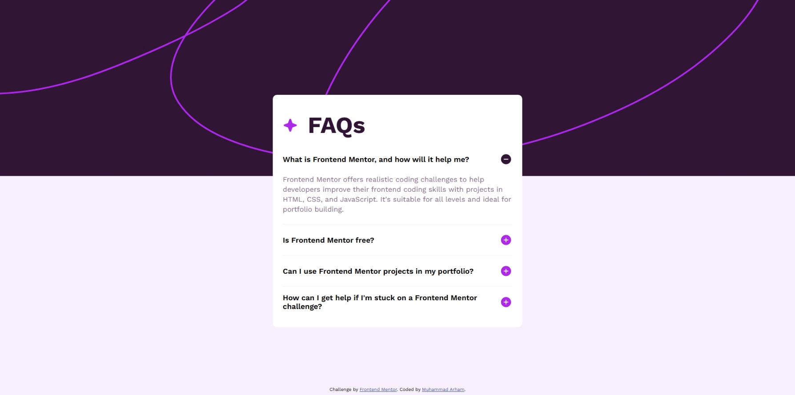

# Frontend Mentor - FAQ accordion solution

This is a solution to the [FAQ accordion challenge on Frontend Mentor](https://www.frontendmentor.io/challenges/faq-accordion-wyfFdeBwBz). Frontend Mentor challenges help you improve your coding skills by building realistic projects. 

## Table of contents

- [Overview](#overview)
  - [The challenge](#the-challenge)
  - [Screenshot](#screenshot)
  - [Links](#links)
- [My process](#my-process)
  - [Built with](#built-with)
  - [What I learned](#what-i-learned)
  - [Continued development](#continued-development)
  - [Useful resources](#useful-resources)
- [Author](#author)


## Overview

### The challenge

Users should be able to:

- Hide/Show the answer to a question when the question is clicked
- Navigate the questions and hide/show answers using keyboard navigation alone
- View the optimal layout for the interface depending on their device's screen size
- See hover and focus states for all interactive elements on the page

### Screenshot



### Links

- Solution URL: [View Code](https://github.com/fa23bcs233/FAQs-Accordion)
- Live Site URL: [Visit Live Site](https://fa23bcs233.github.io/FAQs-Accordion)

## My process

### Built with

- Semantic HTML5 markup
- CSS custom properties
- Flexbox
- CSS Grid
- Mobile-first workflow

### What I learned

One of the biggest lessons in this challenge was understanding how the default behavior of HTML elements affects JavaScript interactions—especially with the <details> tag. Initially, I struggled with getting JavaScript to control the <details> opening behavior. Then I figured out if everything is working expect the one I wanna change is actually reacting is exact opposite manner i understood whats going on the prevented default behaviour of the <details> and nailed it


```html
<div class="faqs-container">
        <div class="faq">
          <details aria-expanded="true"  name="frontend-mentors-faqs" open = "true"> 
            <summary>What is Frontend Mentor, and how will it help me?</summary>
            <div class="details">
              Frontend Mentor offers realistic coding challenges to help developers improve their
              frontend coding skills with projects in HTML, CSS, and JavaScript. It's suitable for
              all levels and ideal for portfolio building.
            </div>
          </details>
        </div>
        <div class="faq" aria-expanded="false" name="frontend-mentors-faqs" open = "false" >
          <details>
            <summary>Is Frontend Mentor free?</summary>
            <div class="details">
              Yes, Frontend Mentor offers both free and premium coding challenges, with the free
              option providing access to a range of projects suitable for all skill levels.
            </div>
          </details>
        </div>
        <div class="faq" aria-expanded="false" name="frontend-mentors-faqs" open = "false" >
          <details>
            <summary>Can I use Frontend Mentor projects in my portfolio?</summary>
            <div class="details">
              Yes, you can use projects completed on Frontend Mentor in your portfolio. It's an excellent
  way to showcase your skills to potential employers!
            </div>
          </details>
        </div>
        <div class="faq" aria-expanded="false" name="frontend-mentors-faqs" open = "false" >
          <details>
            <summary>How can I get help if I'm stuck on a Frontend Mentor challenge?</summary>
            <div class="details">
              The best place to get help is inside Frontend Mentor's Discord community. There's a help 
  channel where you can ask questions and seek support from other community members.
            </div>
          </details>
        </div>
      </div>
```

```js

function HandleClick(event ,details){
    event.preventDefault();

    detailsElements.forEach(element => {
        if(element !== details){
            element.open = false;
            element.setAttribute("aria-expanded" , false)
        }
    });

    details.open = true;
    details.setAttribute("aria-expanded" , true)
}
```

### Continued development

Currently I am focusing on the developing the pages with the correct html sementics and making them accessible next I have planeed to use the js libraries and css preprocessor for the future projects soon.

### Useful resources

- [StackOverflow](https://stackoverflow.com/questions/6195329/how-can-you-hide-the-arrow-that-is-displayed-by-default-on-the-html5-details-e) - This helped me in knowing how to remove the arrow from the details.


## Author

- Website - [Muhammad Arham](https://fa23bcs233.github.io/portfolio)
- Frontend Mentor - [@FA23BCS233](https://www.frontendmentor.io/profile/fa23bcs233)


